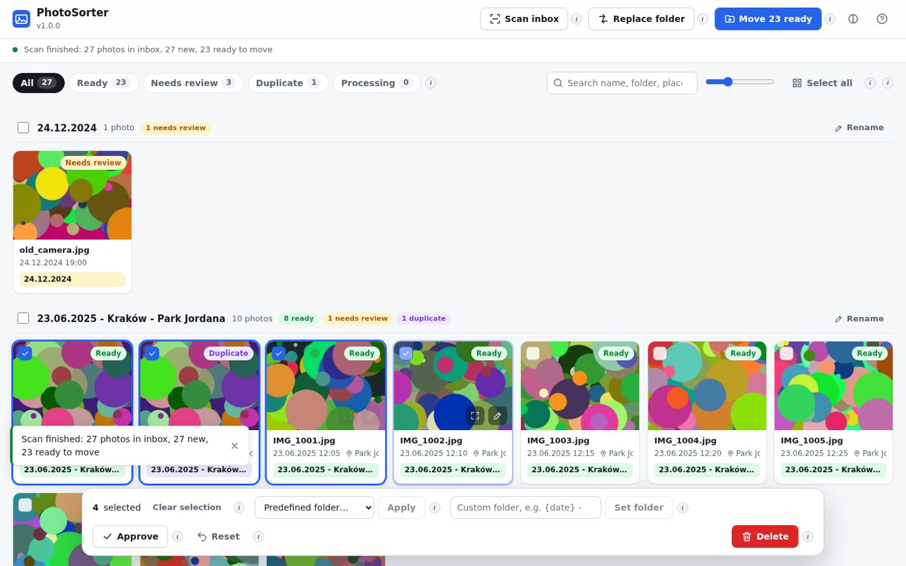

# PhotoSorter2Claude

Semi-automatic photo sorter for your NAS. Drop photos into an inbox folder, press **Scan**, and the
app proposes folders like **`23.06.2025 - Kraków - Park Jordana`** from each photo's date and GPS
position (OpenStreetMap), your own custom places, time/location sessions and document detection.
Review the cards in a fast web UI and move everything that is ready with one click.



📄 **Full documentation (PDF):** [docs/PhotoSorter2Claude-Documentation.pdf](docs/PhotoSorter2Claude-Documentation.pdf) ·
source: [docs/DOCUMENTATION.md](docs/DOCUMENTATION.md) · [CHANGELOG](CHANGELOG.md)

## Quick start (TrueNAS + Portainer)

```bash
mkdir -p /mnt/Legend/containers/persistent_storage/photosorter2claude/{config,data,logs}
chown -R 1000:1000 /mnt/Legend/containers/persistent_storage/photosorter2claude
# put your config.yaml (see config/config.example.yaml) into .../photosorter2claude/config/
```

Then Portainer → **Stacks → Add stack**, paste [`docker-compose.yaml`](docker-compose.yaml)
(or use *Repository* with the Gitea mirror `http://192.168.50.2:3006/wube/PhotoSorter2Claude`),
optionally set variables from [`.env.example`](.env.example), deploy, and open
`http://<nas-ip>:8420`.

| Host | Container |
|---|---|
| `/mnt/Data/pictures/!sort` | `/photos/inbox` |
| `/mnt/Data/pictures/!sorted` | `/photos/sorted` |
| `…/photosorter2claude/config` | `/config` (read-only, `config.yaml`) |
| `…/photosorter2claude/data` | `/data` (database, thumbnails) |
| `…/photosorter2claude/logs` | `/logs` |

Resources: ~70 MB RAM idle, ~260 MB peak while scanning 12 MP photos; the 1 GB cap is plenty.

## Features

- Live scan with progress; tiles pop up as photos are analysed
- `date - city/village - place` naming (restaurants, pubs, museums, parks, playgrounds, streets)
- Custom places with radius (home, family, holiday village)
- Session grouping, no-GPS matching by time, document detection, duplicate detection
- Click / drag / shift-click selection, predefined + custom folders, approve, reset
- Persistent "replace folder" rules and manual choices (survive rescans and restarts)
- One-click "Move ready", double-confirmed delete, "i" help on every button, light/dark theme
- Runs as `1000:1000`, read-only root FS, no capabilities, CSRF protection, optional login

## Releases

Images: `ghcr.io/wube1/photosorter2claude:<version>` (`latest`, `X.Y`, `X.Y.Z`; `edge` = main).
To release: bump [`VERSION`](VERSION), add a [`CHANGELOG`](CHANGELOG.md) entry, rebuild the PDF
(`python scripts/build_docs.py`), commit, then tag `vX.Y.Z` and push the tag.

## Development

```bash
cd frontend && npm ci && npm run build && cd ..
ln -s ../../frontend/dist backend/app/static
cd backend && pip install -r requirements-dev.txt && python -m pytest -q
```
