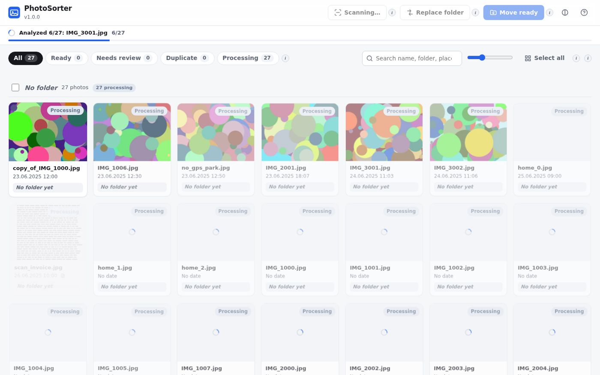
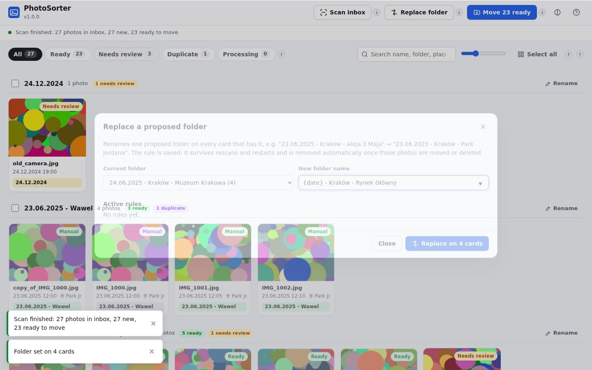
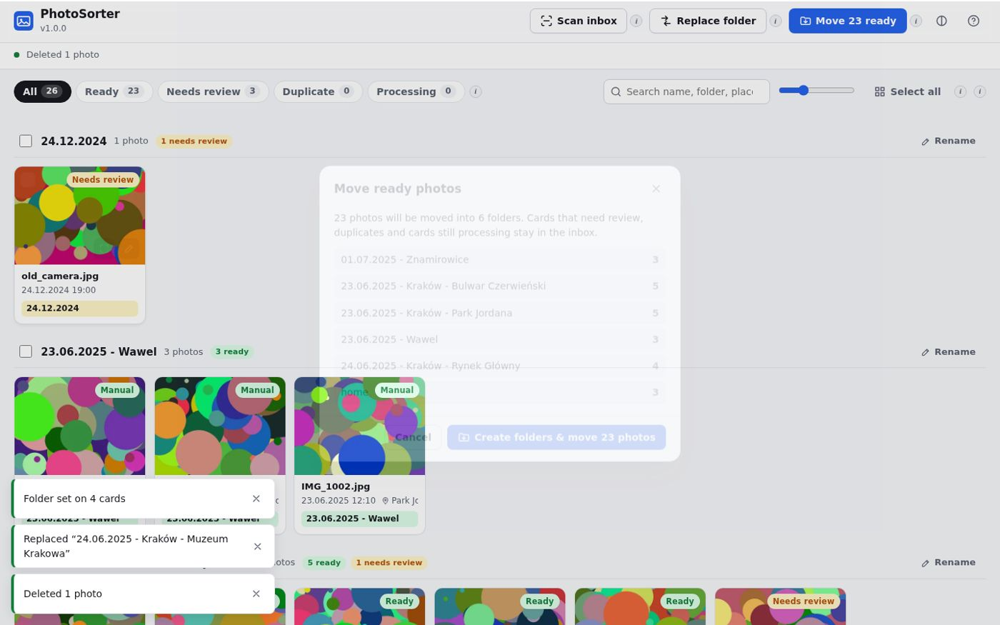
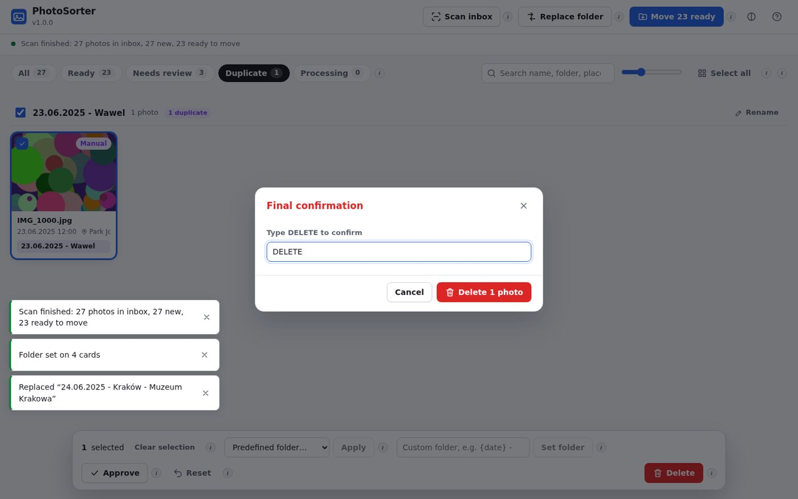
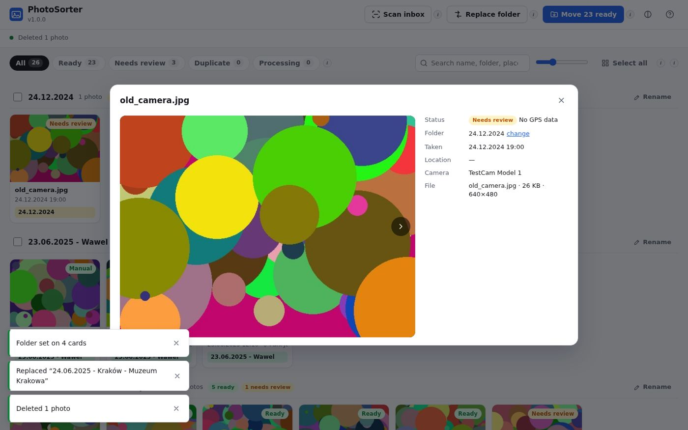

# PhotoSorter2Claude

PhotoSorter2Claude is a small self-hosted web app that sorts photos from an **inbox** folder into an
**output** folder. It reads each photo's date and GPS position, looks up the town and the specific
place (park, restaurant, museum, street …) and proposes a folder such as
**`23.06.2025 - Kraków - Park Jordana`**. You review the proposals in the browser and move everything
that is ready with one click.

It runs as a single Docker container (non-root `1000:1000`, read-only root filesystem) and is
designed for local use on a NAS (TrueNAS + Portainer).


## 1. Features at a glance

| Area | What it does |
|---|---|
| Live scan | Scans the inbox recursively; tiles pop up while photos are analysed, with a live progress bar. |
| Folder names | `date - city/village - specific place` from EXIF date + GPS via OpenStreetMap. |
| Custom places | Your own coordinates + radius (home, family, holiday village) always win. |
| Sessions | Photos taken close together in time and space share the first photo's folder. |
| No GPS | Matched by time to a located session (to review) or dated folder. |
| Documents | Photos of paper documents are detected and proposed as `date - documents`. |
| Duplicates | Identical files (in the inbox or already in the destination) are flagged, never overwritten. |
| Manual control | Tick cards (click, drag-select, shift-click), apply a predefined or custom folder, approve, reset. |
| Replace folder | Rename one proposed folder on every matching card; the rule is persistent. |
| Persistence | Manual choices and rules survive rescans and container restarts until the files are moved/deleted. |
| Move | "Move ready" creates folders and moves every Ready card without rescanning. |
| Delete | Red button with double confirmation (type `DELETE`), permanent or to a trash folder. |
| Help | Every button has an "i" icon explaining what it does; a Help dialog lists everything. |

## 2. Installation (TrueNAS + Portainer)

### 2.1 Prepare folders on the NAS

The container runs as user/group **1000:1000**. Create the app folders and give them to that user:

```bash
mkdir -p /mnt/Legend/containers/persistent_storage/photosorter2claude/{config,data,logs}
chown -R 1000:1000 /mnt/Legend/containers/persistent_storage/photosorter2claude
```

The photo folders must be readable **and writable** by uid/gid 1000 (files are moved out of the inbox):

```bash
# check
ls -ln "/mnt/Data/pictures/!sort" "/mnt/Data/pictures/!sorted"
```

| Host path | Container path | Mode | Purpose |
|---|---|---|---|
| `/mnt/Data/pictures/!sort` | `/photos/inbox` | rw | photos to sort |
| `/mnt/Data/pictures/!sorted` | `/photos/sorted` | rw | destination folders are created here |
| `…/photosorter2claude/config` | `/config` | **ro** | `config.yaml` |
| `…/photosorter2claude/data` | `/data` | rw | database (`photosorter.db`) and thumbnails |
| `…/photosorter2claude/logs` | `/logs` | rw | `photosorter.log` (rotated, 5 × 5 MB) |

### 2.2 Put your config.yaml in place

Copy `config/config.example.yaml` from the repository to
`/mnt/Legend/containers/persistent_storage/photosorter2claude/config/config.yaml` and edit it
(custom places, predefined folders …). See chapter 5. Without a config file the app still works
with built-in defaults and shows a notice.

> Keep personal coordinates (home, family) only in this file on the NAS – never commit them to the
> public repository.

### 2.3 Deploy the stack

**Option A – Web editor (recommended).** Portainer → *Stacks* → *Add stack* → *Web editor*, paste
`docker-compose.yaml` from the repository (or from the release assets), optionally add environment
variables (see below) and click *Deploy the stack*.

**Option B – Git repository.** Portainer → *Stacks* → *Add stack* → *Repository*, URL
`http://192.168.50.2:3006/wube/PhotoSorter2Claude` (your Gitea mirror), compose path
`docker-compose.yaml`. Portainer can then re-pull the stack when the mirror updates.

The stack joins the existing external network `CommonContainerNetwork`, restarts
`unless-stopped` and is capped at **1 GB RAM**. Open `http://<nas-ip>:8420`.

### 2.4 Environment variables

All optional – set them in Portainer's *Environment variables* section or in a `.env` file next to
the compose file (see `.env.example`).

| Variable | Default | Meaning |
|---|---|---|
| `PHOTOSORTER_TAG` | `latest` | Image tag; pin a release like `1.0.0` for reproducible deploys. |
| `PHOTOSORTER_PORT` | `8420` | Port on the NAS. |
| `TZ` | `Europe/Warsaw` | Time zone (used for file dates of photos without EXIF). |
| `PHOTOS_INBOX` | `/mnt/Data/pictures/!sort` | Host inbox folder. |
| `PHOTOS_SORTED` | `/mnt/Data/pictures/!sorted` | Host output folder. |
| `APPDATA` | `/mnt/Legend/containers/persistent_storage/photosorter2claude` | Holds `config`, `data`, `logs`. |
| `PHOTOSORTER_AUTH_USER` / `…_PASSWORD` | empty | Enables a browser login (HTTP basic auth) when both are set. |
| `PHOTOSORTER_ALLOWED_HOSTS` | empty | Comma-separated host names the app answers to, e.g. `192.168.50.2`. |
| `PHOTOSORTER_CONTACT_EMAIL` | empty | Contact sent to OpenStreetMap Nominatim (recommended by their policy). |
| `PHOTOSORTER_LOG_LEVEL` | `INFO` | `DEBUG` for troubleshooting. |

### 2.5 Memory and performance

Measured with 12-megapixel JPEG and HEIC photos and 2 analysis workers: **~60–80 MB idle,
~260 MB peak while scanning**. The 1 GB limit leaves plenty of headroom (large panoramas, more
workers); 512 MB would also work. JPEGs are decoded at reduced resolution for thumbnails, so a scan
is mostly limited by disk speed. Each photo is read once for hashing and analysis; unchanged files
are skipped on later scans and place names are cached, so rescans are fast.

**Tip – instant moves.** Inbox and output are separate bind mounts, so Linux has to *copy* a file
between them (then deletes the original after verifying the size). If both folders live on the same
dataset you can mount their parent once and point the app at sub-folders – moves then become
instant renames:

```yaml
    volumes:
      - /mnt/Data/pictures:/photos
    environment:
      PHOTOSORTER_INBOX: "/photos/!sort"
      PHOTOSORTER_SORTED: "/photos/!sorted"
```

## 3. Using the app



### 3.1 Workflow

1. Copy photos into the inbox (sub-folders are fine).
2. Press **Scan inbox**. Tiles appear immediately and update live: date and GPS are read, thumbnails
   made, duplicates and documents detected, then locations looked up.
3. Review the groups. Each group header is a proposed folder with a status summary.
4. Fix what needs fixing (tick cards → apply a folder, approve, rename a folder everywhere …).
5. Press **Move N ready** → confirm. Folders are created and Ready photos moved.
6. Cards that need review, duplicates and unfinished cards stay in the inbox for later.

### 3.2 Statuses

| Status | Meaning |
|---|---|
| **Ready** | Confidently classified (custom place, or GPS + town found), or set/approved by you. Moved by *Move ready*. |
| **Needs review** | No GPS, possible document, location lookup failed, only a file date, or unreadable. Check and approve or set a folder. |
| **Duplicate** | Same content as another inbox photo, or already present in the destination folder. Delete it, or approve it to move anyway (it is still never written over an identical file). |
| **Processing** | Still being analysed or located; updates automatically. |
| **Manual** badge | You set the folder yourself; the card is Ready. |

### 3.3 Buttons

| Button | What it does |
|---|---|
| **Scan inbox** | Scans for new/changed photos with live progress. Keeps your manual choices. Can be used any time, e.g. after everything was moved. |
| **Replace folder** | Renames one proposed folder on every card that has it. Saved as a rule that survives rescans and restarts and disappears automatically once those photos are moved or deleted. Each group header also has a **Rename** shortcut. |
| **Move N ready** | Uses the current cards **without rescanning**: creates destination folders and moves every Ready card. Review, duplicate and processing cards stay. Existing files are never overwritten (`name (1).jpg` is used on a name clash; identical content is flagged as duplicate). |
| **Status tabs** | Filter by All / Ready / Needs review / Duplicate / Processing. |
| **Search** | Filters by file name, folder, place, town or camera. |
| **Tile size slider** | Bigger or smaller tiles. |
| **Select all** | Ticks every card currently shown. |
| **Group checkbox** | Ticks/unticks every card of that folder group. |
| **Clear selection** | Unticks everything (Esc does the same). |
| **Predefined folder … Apply** | Applies a folder from `predefined_folders` in config.yaml to the ticked cards. `{date}` becomes each photo's date. |
| **Custom folder … Set folder** | Applies any folder name you type to the ticked cards (supports `{date}`), e.g. `{date} - Kraków - Wawel`. |
| **Approve** | Marks ticked cards Ready with their current proposal (e.g. no-GPS photos matched by time, documents). |
| **Reset** | Removes your manual folder/approval and returns to the automatic proposal. |
| **Delete** (red) | Deletes the ticked photos after two confirmations (second one: type `DELETE`). |
| **Theme** | Light / dark / automatic. |
| **Help (?)** | All button descriptions, statuses, keyboard shortcuts and current configuration. |
| **"i" icons** | Hover, focus or tap for a description of the button next to it. |

Manual folders, approvals and replacement rules are stored in the database in `/data`. They
survive rescans and container restarts and are removed only when the photo is moved, deleted or
disappears from the inbox.

### 3.4 Selecting cards

* **Click** a tile to tick/untick it.
* **Click and hold** the left mouse button and move over other tiles to tick (or untick, if the
  first tile was ticked) many at once.
* **Shift+click** ticks a range.
* **Ctrl+A** ticks all shown cards, **Esc** clears the selection.
* **Double-click** (or the expand button) opens a large preview with all details, a map link and
  ←/→ navigation. The pencil button edits one card's folder.









## 4. How folder names are chosen

For every photo, in this order:

1. **Unreadable file** → `date` (file date), *Needs review*.
2. **Paper document** (heuristic: bright colourless paper, thin dark text strokes, also when the
   sheet lies on a table) → `date - documents`, *Needs review* by default.
3. **Custom place** – GPS within the radius of a place from config.yaml (smallest radius wins) →
   that place's folder, *Ready*.
4. **GPS** – photos are grouped into **sessions**: a session continues while the gap to the
   previous photo is ≤ 90 min and the photo is within 250 m of the session's first photo. The
   first photo is looked up once and all photos of the session get its folder and date:
   * **city** = city / town / village from OpenStreetMap Nominatim, in Polish (`Kraków`);
   * **place** = the nearest named point of interest within 45 m (restaurant, pub, café, museum,
     playground, church …, via Overpass); otherwise the named area you are in (park, museum
     grounds …); otherwise the street / promenade / square (`Bulwar Czerwieński`);
   * aliases from config.yaml are applied (`Park im. dr. Henryka Jordana` → `Park Jordana`).
   Result: `date - city - place`, or `date - city` when no place is known. *Ready*.
5. **No GPS** – if a located session has a photo within 90 minutes, its folder is proposed
   (*Needs review*); otherwise `date` (*Needs review*).

Then your **replacement rules** are applied, and a **manual folder** always wins. Folder names are
sanitised (no `/ \ : * ? " < > |`, no `..`), so a name can never point outside the output folder.

Location lookups are cached in the database (≈ 11 m grid), so each place is looked up only once
ever. The public OpenStreetMap services are used politely (≤ 1 request per second, identifying
user agent). If the NAS is offline, affected photos get *Needs review* and are retried on the next
scan.

## 5. Configuration reference (config.yaml)

`config.yaml` is mounted read-only; restart the container after changes. Every key is optional.

```yaml
naming:
  date_format: "%d.%m.%Y"
  location_template: "{date} - {city} - {place}"
  city_only_template: "{date} - {city}"
  documents_template: "{date} - documents"
  no_location_template: "{date}"
  street_fallback: true
  aliases:
    "Park im. dr. Henryka Jordana": "Park Jordana"

places:                     # custom places, smallest radius wins
  - name: Home
    lat: 50.000000
    lon: 19.000000
    radius_m: 50
    folder: "home"          # no {date}: all photos in one folder
  - name: Village
    lat: 49.000000
    lon: 20.000000
    radius_m: 4000
    folder: "{date} - Village"

grouping:
  enabled: true
  max_gap_minutes: 90
  radius_m: 250
  attach_no_gps_by_time: true

geocoding:
  enabled: true
  language: pl
  nominatim_url: https://nominatim.openstreetmap.org
  overpass_url: https://overpass-api.de/api/interpreter
  poi_radius_m: 45
  min_interval_s: 1.1
  poi_keys: [amenity, tourism, leisure, historic]
  area_keys: [leisure, tourism, amenity, historic]

documents:
  enabled: true
  min_score: 0.6
  status: review            # or ready

scan:
  workers: 2
  min_file_age_s: 5
  extensions: [.jpg, .jpeg, .png, .heic, .heif, .webp, .tif, .tiff]

delete_mode: permanent      # or trash  (-> <inbox>/.photosorter-trash)
ready_requires_place: false
predefined_folders:
  - "home"
  - "{date} - documents"
```

Template fields: `{date}` `{year}` `{month}` `{day}` `{city}` `{place}`. Empty parts are removed
cleanly (`23.06.2025 - Kraków` instead of `23.06.2025 - Kraków - `).

## 6. Security

The app is meant for your LAN only (plain HTTP). Built-in protections:

* Runs as **1000:1000**, **read-only root filesystem**, **all Linux capabilities dropped**,
  `no-new-privileges`, 1 GB memory cap.
* Config is mounted **read-only**; the app only writes to `/data`, `/logs` and the two photo folders.
* All file operations are confined to the inbox/output folders (paths resolved and checked; folder
  names sanitised; files are addressed by id, never by a path from the browser).
* Existing files are never overwritten; copies across mounts are verified before the source is removed.
* Every state-changing request needs a custom header, which browsers cannot send cross-site
  (CSRF protection); strict Content-Security-Policy, `X-Frame-Options: DENY`, no-referrer.
* Optional **login** (`PHOTOSORTER_AUTH_USER/PASSWORD`) and **host allow-list**
  (`PHOTOSORTER_ALLOWED_HOSTS`, protects against DNS-rebinding).
* No API docs endpoint, no server banner, no telemetry. Outbound traffic only to OpenStreetMap
  (coordinates of the first photo of each session) – disable with `geocoding.enabled: false`.

Do not expose the port to the internet. If you ever need remote access, use a VPN (WireGuard /
Tailscale) or a reverse proxy with HTTPS and authentication in front of it.

## 7. Troubleshooting

| Problem | Fix |
|---|---|
| "Inbox folder … does not exist or is not mounted" | Check the volume paths; the container must see `/photos/inbox`. |
| Move fails with "Permission denied" | The photo folders must be writable by uid/gid 1000 (`chown`/ACL on the dataset). |
| Container restarts, log says database is read-only | `…/photosorter2claude/data` and `logs` must be owned by 1000:1000. |
| Notice "No config.yaml found" | Put `config.yaml` into `…/photosorter2claude/config/`, restart. |
| Many photos "Location lookup failed" | The container needs internet access to `nominatim.openstreetmap.org` and `overpass-api.de`. They are retried on the next scan. |
| Wrong/odd place name | Add an alias in `naming.aliases`, a custom place, or use *Replace folder*. |
| A normal photo detected as document | Raise `documents.min_score` (e.g. 0.75) or just set its folder. |
| `docker pull` says unauthorized | Make the GHCR package public: GitHub → Profile → Packages → photosorter2claude → Package settings → Change visibility. |

Logs: `…/photosorter2claude/logs/photosorter.log` (or Portainer → container → Logs). Set
`PHOTOSORTER_LOG_LEVEL=DEBUG` for more detail.

## 8. Releases, versions and updates

* Versions follow **Semantic Versioning** (`MAJOR.MINOR.PATCH`); the single source of truth is the
  `VERSION` file; changes are listed in `CHANGELOG.md`.
* Pushing a tag `vX.Y.Z` runs the release workflow: tests → multi-arch image
  (`linux/amd64`, `linux/arm64`) pushed to `ghcr.io/wube1/photosorter2claude` with tags `X.Y.Z`,
  `X.Y` and `latest` → a GitHub Release with the compose file, `.env.example`,
  `config.example.yaml` and this PDF attached.
* Every push to `main` builds and pushes an `edge` image; every push/PR runs tests, the UI build
  and a container smoke test (non-root, read-only).
* **Update**: Portainer → Stack → *Pull and redeploy* (with `latest`), or change `PHOTOSORTER_TAG`
  to the new version. Your database, rules and manual choices are kept in `/data`.
* **Rollback**: set `PHOTOSORTER_TAG` to the previous version.

## 9. Architecture (for development)

| Part | Technology |
|---|---|
| Backend | Python 3.13, FastAPI + Uvicorn, SQLite (WAL), Pillow + pillow-heif, httpx |
| Frontend | React 19 + TypeScript + Vite, hand-written CSS (light/dark), no UI framework |
| Live updates | Server-Sent Events (`/api/events`) |
| Image | Multi-stage Docker build: Node builds the UI, slim Python runtime serves API + UI |

```
backend/app/
  main.py        API, SSE, security middleware, static UI
  engine.py      scan / propose / move / delete jobs, overrides, replacement rules
  media.py       hashing, EXIF (date, GPS, camera), thumbnails, document detection
  geocoder.py    OpenStreetMap Nominatim + Overpass with cache and rate limit
  proposals.py   templates, sanitising, sessions, effective folder/status
  config.py      defaults + config.yaml + environment
frontend/src/    App.tsx, components.tsx, dialogs.tsx, store.ts (SSE), help.ts (all "i" texts)
```

Run locally:

```bash
cd frontend && npm ci && npm run build && cd ..
ln -s ../../frontend/dist backend/app/static
cd backend && pip install -r requirements-dev.txt && python -m pytest -q
PHOTOSORTER_INBOX=/tmp/in PHOTOSORTER_SORTED=/tmp/out PHOTOSORTER_DATA=/tmp/data \
PHOTOSORTER_LOGS=/tmp/logs PHOTOSORTER_CONFIG=../config/config.example.yaml python -m app.main
```

Rebuild this PDF: `python scripts/build_docs.py` (needs `markdown` and `playwright` with Chromium).

### API

| Method | Path | Purpose |
|---|---|---|
| GET | `/healthz` | health check (no auth) |
| GET | `/api/state` | all cards, rules, job, config summary |
| GET | `/api/events` | Server-Sent Events: `cards`, `removed`, `job`, `replacements`, `reload` |
| POST | `/api/scan` | start a scan |
| POST | `/api/cards/folder` | `{ids, folder}` set (or `null` clear) manual folder |
| POST | `/api/cards/approve` | `{ids, approved}` |
| POST | `/api/cards/reset` | `{ids}` |
| POST / DELETE | `/api/replacements[/id]` | add / remove a replacement rule |
| POST | `/api/move` | `{ids: null}` move all Ready cards |
| POST | `/api/delete` | `{ids, confirm: "DELETE"}` |
| GET | `/api/thumb/{id}`, `/api/preview/{id}` | thumbnail (WebP), preview (JPEG) |

All POST/DELETE requests need the header `X-PhotoSorter: 1`.
